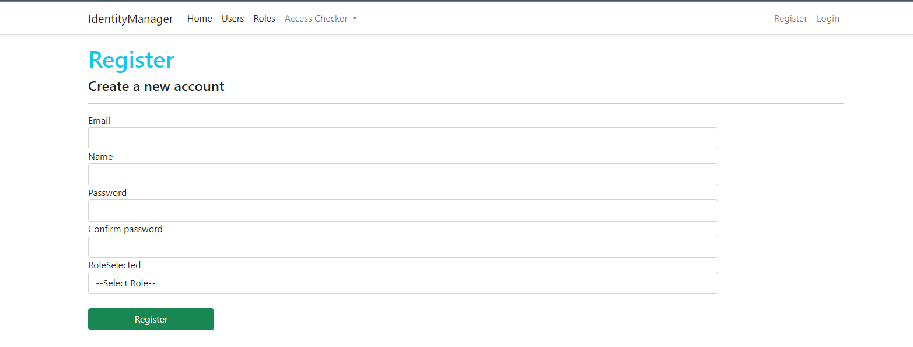
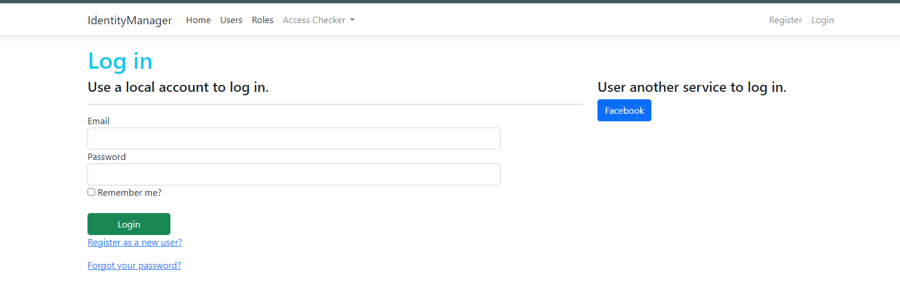
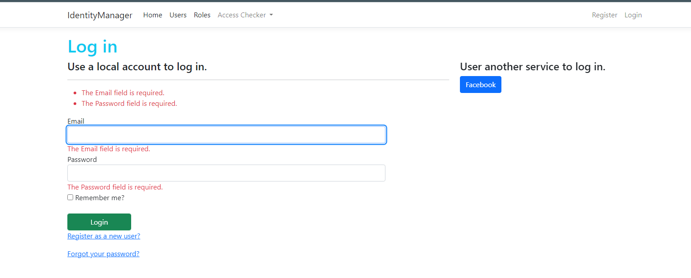
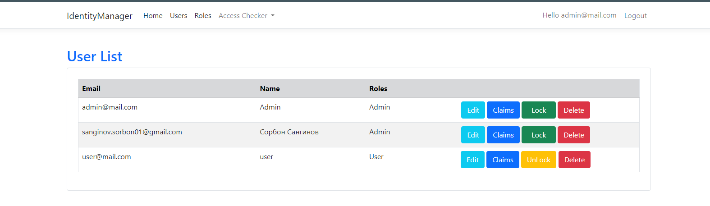
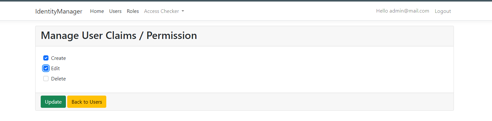
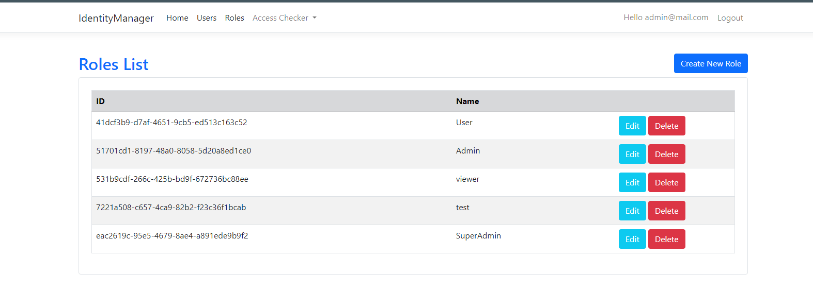
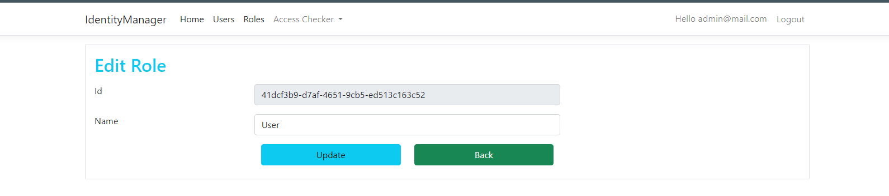

# Identity Manager - Asp.Net Core
- Account - Register, Login, ExternalLogin, ConfirmEmail,ForgotPassword, ResetPassword;
- User - UserList, Edit, Lock, Claim, Delete;
- Role - RoleList, Create, Edit, Delete;
- AccessChecker - 11 type;

ASP.NET Core now includes the new identity system, which replaces the legacy membership system in ASP.NET. It is essential that software engineers learn these relevant skills and apply them when developing MVC applications if they do not want to combine razor pages with MVC.

